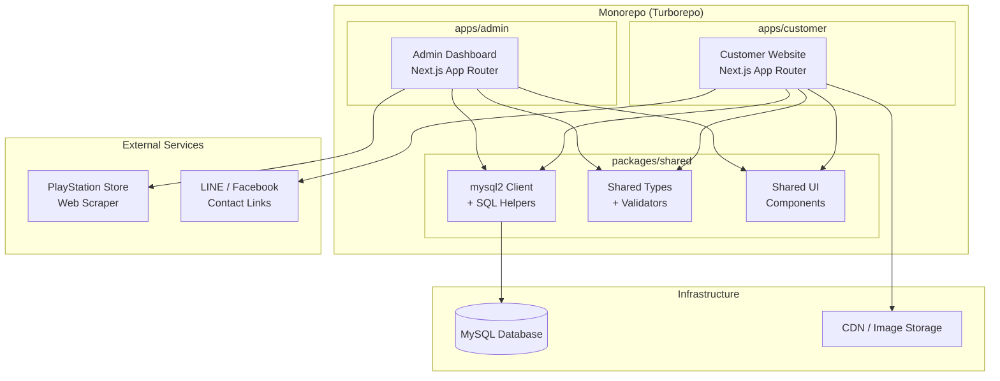
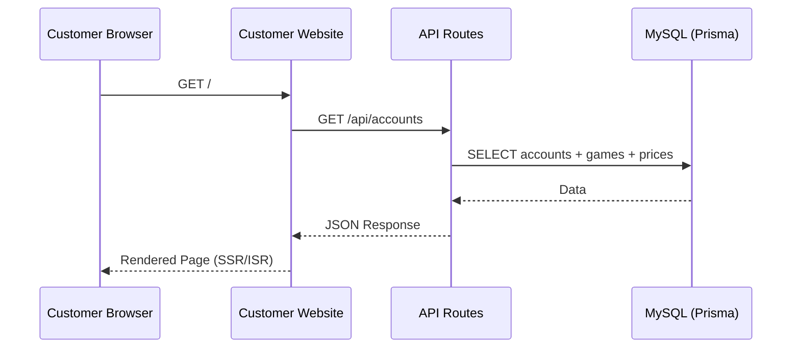
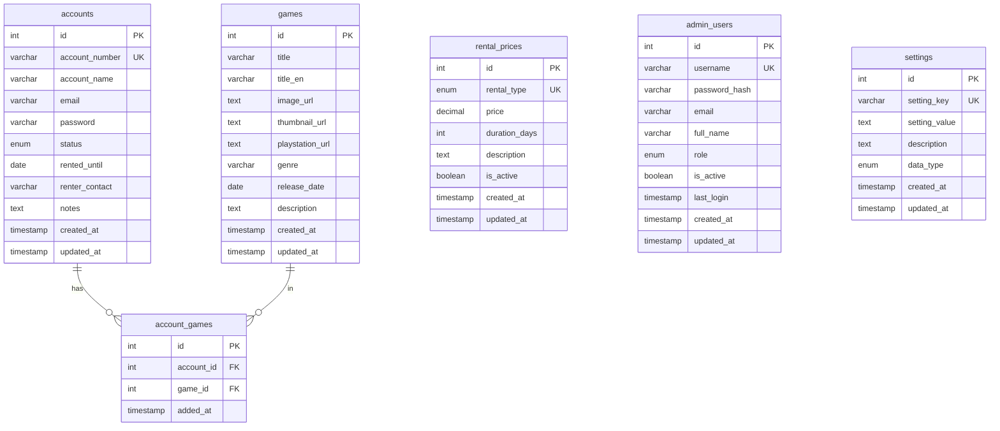

# Design Document: Ninja Shop — PlayStation ID Rental Website

## Overview

Ninja Shop เป็นเว็บไซต์สำหรับให้เช่าไอดี PlayStation โดยแบ่งออกเป็น 2 ส่วนหลัก:

1. **Customer Website** — หน้าสาธารณะสำหรับลูกค้าดูรายการไอดีและเกม ไม่ต้องสมัครสมาชิกหรือ login
2. **Admin Dashboard** — เว็บแยกต่างหากสำหรับแอดมินจัดการข้อมูล มีระบบ login ด้วย JWT

ระบบใช้ธีมสีดำ-น้ำเงิน (Dark/Blue) และรองรับ Responsive Design ทุกขนาดหน้าจอ

### เป้าหมายหลัก

- ลูกค้าสามารถดูรายการไอดีพร้อมเกมและราคาได้ทันที โดยไม่ต้อง login
- แอดมินจัดการข้อมูลได้ครบถ้วนผ่าน Dashboard ที่ปลอดภัย
- ดึงข้อมูลเกมอัตโนมัติจาก PlayStation Store ผ่าน Web Scraper
- ประสิทธิภาพสูง โหลดเร็ว รองรับทุกอุปกรณ์

---

## Architecture

ระบบใช้สถาปัตยกรรมแบบ **Monorepo** ที่มี 2 Next.js applications แยกกัน แต่ใช้ shared packages ร่วมกัน



### การแยก Application

| ส่วน | URL | Port (Dev) | Authentication |
|------|-----|-----------|----------------|
| Customer Website | `/` | 7000 | ไม่มี (Public) |
| Admin Dashboard | `/admin` หรือ subdomain | 7001 | JWT Required |

### Request Flow



### Caching Strategy

- **Customer Website**: ใช้ Next.js ISR (Incremental Static Regeneration) revalidate ทุก 60 วินาที
- **Admin Dashboard**: ใช้ Server-Side Rendering (SSR) เพื่อข้อมูลล่าสุดเสมอ
- **Static Assets**: Cache ผ่าน CDN พร้อม long-lived cache headers

---

## Components and Interfaces

### Customer Website Components

#### Layout Components

```
app/
├── layout.tsx              # Root layout (fonts, theme, metadata)
├── page.tsx                # Home page (ID listings)
├── components/
│   ├── Header.tsx          # Logo + navigation + contact button
│   ├── Footer.tsx          # Shop info + links
│   ├── MobileDrawer.tsx    # Slide-in nav สำหรับ mobile
│   └── HeroSection.tsx     # Banner แนะนำบริการ
```

#### Account Card Components

```
components/account/
├── AccountGrid.tsx         # Grid layout ของ ID cards ทั้งหมด
├── AccountCard.tsx         # Card หลักของแต่ละ ID
├── StatusBadge.tsx         # แสดงสถานะ Available/Rented
├── GameGrid.tsx            # Grid รูปเกมในแต่ละ ID
├── GameThumbnail.tsx       # รูปเกมพร้อม hover/tap title
├── PricingTable.tsx        # ตารางราคา 3 ประเภท
└── ContactButton.tsx       # ปุ่มติดต่อ LINE/Facebook
```

#### Component Interfaces

```typescript
// AccountCard Props
interface AccountCardProps {
  account: {
    id: number
    account_number: string
    status: 'available' | 'rented'
    rented_until: string | null
    games: Game[]
  }
  prices: RentalPrice[]
  contactSettings: ContactSettings
}

// GameThumbnail Props
interface GameThumbnailProps {
  game: {
    id: number
    title: string
    image_url: string
    thumbnail_url: string | null
  }
}

// PricingTable Props
interface PricingTableProps {
  prices: RentalPrice[]
}

// ContactButton Props
interface ContactButtonProps {
  accountNumber: string
  lineUrl: string | null
  facebookUrl: string | null
}
```

### Admin Dashboard Components

#### Layout Components

```
admin/
├── layout.tsx              # Admin root layout (auth check)
├── login/page.tsx          # Login page
├── dashboard/
│   ├── layout.tsx          # Dashboard layout (sidebar + topbar)
│   ├── page.tsx            # Overview/stats
│   ├── accounts/           # จัดการ PlayStation IDs
│   ├── games/              # จัดการเกม + scraper
│   ├── prices/             # จัดการราคา
│   └── settings/           # ตั้งค่าระบบ
```

#### Admin Component Interfaces

```typescript
// Admin Account Form
interface AccountFormData {
  account_number: string
  account_name?: string
  email?: string
  password?: string
  status: 'available' | 'rented'
  rented_until?: string
  renter_contact?: string
  notes?: string
}

// Game Scraper Result
interface ScrapedGame {
  title: string
  title_en?: string
  image_url: string
  thumbnail_url?: string
  playstation_url: string
  genre?: string
  release_date?: string
  description?: string
}

// JWT Payload
interface AdminJWTPayload {
  sub: number          // admin_user id
  username: string
  role: 'admin' | 'super_admin'
  iat: number
  exp: number
}
```

### API Routes Interface

#### Customer API (Public)

| Method | Path | Description |
|--------|------|-------------|
| GET | `/api/accounts` | ดึงรายการ ID ทั้งหมดพร้อมเกมและราคา |
| GET | `/api/settings/contact` | ดึง LINE/Facebook URL |
| GET | `/api/prices` | ดึงราคาเช่าที่ active |

#### Admin API (JWT Protected)

| Method | Path | Description |
|--------|------|-------------|
| POST | `/api/admin/auth/login` | Login รับ JWT |
| GET | `/api/admin/accounts` | รายการ ID ทั้งหมด |
| POST | `/api/admin/accounts` | สร้าง ID ใหม่ |
| PUT | `/api/admin/accounts/:id` | แก้ไข ID |
| DELETE | `/api/admin/accounts/:id` | ลบ ID |
| PUT | `/api/admin/accounts/:id/status` | อัพเดทสถานะเช่า |
| GET | `/api/admin/games` | รายการเกมทั้งหมด |
| POST | `/api/admin/games` | เพิ่มเกมใหม่ |
| DELETE | `/api/admin/games/:id` | ลบเกม |
| POST | `/api/admin/games/scrape` | ค้นหาเกมจาก PS Store |
| POST | `/api/admin/accounts/:id/games` | เพิ่มเกมให้ ID |
| DELETE | `/api/admin/accounts/:id/games/:gameId` | ลบเกมออกจาก ID |
| GET | `/api/admin/prices` | ดึงราคาทั้งหมด |
| PUT | `/api/admin/prices/:id` | อัพเดทราคา |
| GET | `/api/admin/settings` | ดึง settings ทั้งหมด |
| PUT | `/api/admin/settings/:key` | อัพเดท setting |

---

## Data Models

### Database Schema (SQL)

ใช้ `mysql2` โดยตรง ไม่มี ORM — schema สร้างด้วย SQL migration file

```sql
-- packages/shared/src/db/schema.sql

CREATE TABLE IF NOT EXISTS accounts (
  id              INT AUTO_INCREMENT PRIMARY KEY,
  account_number  VARCHAR(50) NOT NULL UNIQUE,
  account_name    VARCHAR(100),
  email           VARCHAR(255),
  password        VARCHAR(255),
  status          ENUM('available', 'rented') NOT NULL DEFAULT 'available',
  rented_until    DATE,
  renter_contact  VARCHAR(255),
  notes           TEXT,
  created_at      TIMESTAMP DEFAULT CURRENT_TIMESTAMP,
  updated_at      TIMESTAMP DEFAULT CURRENT_TIMESTAMP ON UPDATE CURRENT_TIMESTAMP
);

CREATE TABLE IF NOT EXISTS games (
  id               INT AUTO_INCREMENT PRIMARY KEY,
  title            VARCHAR(255) NOT NULL,
  title_en         VARCHAR(255),
  image_url        TEXT,
  thumbnail_url    TEXT,
  playstation_url  TEXT,
  genre            VARCHAR(100),
  release_date     DATE,
  description      TEXT,
  created_at       TIMESTAMP DEFAULT CURRENT_TIMESTAMP,
  updated_at       TIMESTAMP DEFAULT CURRENT_TIMESTAMP ON UPDATE CURRENT_TIMESTAMP
);

CREATE TABLE IF NOT EXISTS account_games (
  id          INT AUTO_INCREMENT PRIMARY KEY,
  account_id  INT NOT NULL,
  game_id     INT NOT NULL,
  added_at    TIMESTAMP DEFAULT CURRENT_TIMESTAMP,
  UNIQUE KEY unique_account_game (account_id, game_id),
  FOREIGN KEY (account_id) REFERENCES accounts(id) ON DELETE CASCADE,
  FOREIGN KEY (game_id)    REFERENCES games(id)    ON DELETE CASCADE
);

CREATE TABLE IF NOT EXISTS rental_prices (
  id            INT AUTO_INCREMENT PRIMARY KEY,
  rental_type   ENUM('ps5_own', 'ps5_shop', 'ps4') NOT NULL UNIQUE,
  price         DECIMAL(10, 2) NOT NULL,
  duration_days INT NOT NULL DEFAULT 30,
  description   TEXT,
  is_active     TINYINT(1) NOT NULL DEFAULT 1,
  created_at    TIMESTAMP DEFAULT CURRENT_TIMESTAMP,
  updated_at    TIMESTAMP DEFAULT CURRENT_TIMESTAMP ON UPDATE CURRENT_TIMESTAMP
);

CREATE TABLE IF NOT EXISTS admin_users (
  id            INT AUTO_INCREMENT PRIMARY KEY,
  username      VARCHAR(50) NOT NULL UNIQUE,
  password_hash VARCHAR(255) NOT NULL,
  email         VARCHAR(255),
  full_name     VARCHAR(100),
  role          ENUM('admin', 'super_admin') NOT NULL DEFAULT 'admin',
  is_active     TINYINT(1) NOT NULL DEFAULT 1,
  last_login    TIMESTAMP NULL,
  created_at    TIMESTAMP DEFAULT CURRENT_TIMESTAMP,
  updated_at    TIMESTAMP DEFAULT CURRENT_TIMESTAMP ON UPDATE CURRENT_TIMESTAMP
);

CREATE TABLE IF NOT EXISTS settings (
  id            INT AUTO_INCREMENT PRIMARY KEY,
  setting_key   VARCHAR(100) NOT NULL UNIQUE,
  setting_value TEXT,
  description   TEXT,
  data_type     ENUM('string', 'number', 'boolean', 'json') NOT NULL DEFAULT 'string',
  created_at    TIMESTAMP DEFAULT CURRENT_TIMESTAMP,
  updated_at    TIMESTAMP DEFAULT CURRENT_TIMESTAMP ON UPDATE CURRENT_TIMESTAMP
);
```

### Database Connection (mysql2)

```typescript
// packages/shared/src/db/client.ts
import mysql from 'mysql2/promise'

const pool = mysql.createPool({
  host:     process.env.DB_HOST     ?? 'localhost',
  port:     Number(process.env.DB_PORT ?? 3306),
  user:     process.env.DB_USER     ?? 'root',
  password: process.env.DB_PASSWORD ?? '',
  database: process.env.DB_NAME     ?? 'ninja_shop',
  waitForConnections: true,
  connectionLimit: 10,
})

export default pool
```

`.env` ที่ต้องตั้งค่า:
```
DB_HOST=localhost
DB_PORT=3306
DB_USER=root
DB_PASSWORD=yourpassword
DB_NAME=ninja_shop
```

### TypeScript Types (Shared)

```typescript
// packages/shared/src/types/index.ts

export type AccountStatus = 'available' | 'rented'
export type RentalType = 'ps5_own' | 'ps5_shop' | 'ps4'
export type AdminRole = 'admin' | 'super_admin'
export type SettingDataType = 'string' | 'number' | 'boolean' | 'json'

export interface Account {
  id: number
  account_number: string
  account_name: string | null
  status: AccountStatus
  rented_until: string | null  // ISO date string
  notes: string | null
  games: Game[]
}

export interface Game {
  id: number
  title: string
  title_en: string | null
  image_url: string | null
  thumbnail_url: string | null
  playstation_url: string | null
  genre: string | null
}

export interface RentalPrice {
  id: number
  rental_type: RentalType
  price: number
  duration_days: number
  description: string | null
  is_active: boolean
}

export interface ContactSettings {
  line_url: string | null
  facebook_url: string | null
}

// Validation schemas (Zod)
export const accountFormSchema = z.object({
  account_number: z.string().min(1).max(50),
  account_name: z.string().max(100).optional(),
  status: z.enum(['available', 'rented']),
  rented_until: z.string().date().optional().nullable(),
  renter_contact: z.string().max(255).optional(),
  notes: z.string().optional(),
})

export const priceUpdateSchema = z.object({
  price: z.number().positive(),
  duration_days: z.number().int().positive(),
  description: z.string().optional(),
  is_active: z.boolean(),
})

export const loginSchema = z.object({
  username: z.string().min(1),
  password: z.string().min(1),
})
```

### Database Relationships Diagram



### Color Theme Constants

```typescript
// packages/shared/theme/colors.ts
export const THEME = {
  background: '#0a0e27',
  secondaryBg: '#1a1f3a',
  accentBlue: '#00d4ff',
  accentBlue2: '#0066ff',
  textPrimary: '#ffffff',
  textSecondary: '#a0aec0',
  cardBg: '#151a30',
  border: '#2d3748',
} as const
```

### Responsive Breakpoints

```typescript
// packages/shared/theme/breakpoints.ts
export const BREAKPOINTS = {
  mobile: 768,    // < 768px: 1 column
  tablet: 1024,   // 768-1023px: 2 columns
  desktop: 1024,  // >= 1024px: 3 columns
} as const

// Tailwind config mapping
// sm: 640px, md: 768px, lg: 1024px, xl: 1280px
```

---

## Correctness Properties

*A property is a characteristic or behavior that should hold true across all valid executions of a system — essentially, a formal statement about what the system should do. Properties serve as the bridge between human-readable specifications and machine-verifiable correctness guarantees.*

**Property Reflection:** หลังจากวิเคราะห์ acceptance criteria ทั้งหมด พบว่า properties หลายตัวสามารถรวมกันได้:
- Properties เกี่ยวกับ status display (1.6, 1.7) รวมเป็น property เดียวเรื่อง status formatting
- Properties เกี่ยวกับ contact button (3.4, 3.5) รวมเป็น property เดียวเรื่อง conditional rendering
- Properties เกี่ยวกับ cascade delete (14.2, 14.3) รวมเป็น property เดียว
- Properties เกี่ยวกับ URL validation (11.3, 11.4) รวมเป็น property เดียว

---

### Property 1: Account Number Format

*For any* account record with an account_number field, the rendered Account_Card should display text that matches the pattern "ID No.X" where X corresponds to the account's sequential identifier.

**Validates: Requirements 1.5**

---

### Property 2: Rental Status Display

*For any* account with status `available`, the status display should show "Available". *For any* account with status `rented` and a non-null `rented_until` date, the status display should show "Rented until [date]" where [date] is formatted as YYYY-MM-DD.

**Validates: Requirements 1.6, 1.7**

---

### Property 3: Game Library Completeness

*For any* account with N games in its game library, the rendered Account_Card should contain exactly N game thumbnail elements — no more, no fewer.

**Validates: Requirements 1.8**

---

### Property 4: Pricing Table Completeness

*For any* list of active rental prices, the PricingTable component should render all of them — every active rental type must appear in the table.

**Validates: Requirements 1.9, 10.7**

---

### Property 5: Contact Button Conditional Rendering

*For any* non-null LINE URL, the ContactButton should render a LINE icon and label. *For any* non-null Facebook URL, the ContactButton should render a Facebook icon and label. The rendered options should correspond exactly to which URLs are configured.

**Validates: Requirements 3.1, 3.4, 3.5**

---

### Property 6: JWT Expiration Invariant

*For any* successful admin login, the generated JWT token should have an expiration time (`exp`) that is exactly 86400 seconds (24 hours) after the issued-at time (`iat`).

**Validates: Requirements 5.2**

---

### Property 7: Invalid Credentials Always Rejected

*For any* username/password combination that does not match a valid, active admin user in the database, the login endpoint should return an error response and must not issue a JWT token.

**Validates: Requirements 5.3**

---

### Property 8: Protected Routes Require Valid JWT

*For any* request to a protected admin API route, if the request does not include a valid, non-expired JWT token, the response should be HTTP 401 Unauthorized.

**Validates: Requirements 5.5**

---

### Property 9: Login Updates Last Login Timestamp

*For any* successful admin login, the `last_login` field of the corresponding admin_users record should be updated to a timestamp within a few seconds of the login time.

**Validates: Requirements 5.7**

---

### Property 10: Account Number Uniqueness Enforcement

*For any* attempt to create a new account with an `account_number` that already exists in the accounts table, the operation should fail with a validation error and no new record should be inserted.

**Validates: Requirements 6.3**

---

### Property 11: Account Creation Persistence

*For any* valid account form submission, the resulting record in the accounts table should have field values that exactly match the submitted form data.

**Validates: Requirements 6.4**

---

### Property 12: Cascade Delete on Account Removal

*For any* account deletion, all records in the account_games table with the matching account_id should also be deleted — no orphaned account_game records should remain.

**Validates: Requirements 6.8, 14.2**

---

### Property 13: Cascade Delete on Game Removal

*For any* game deletion, all records in the account_games table with the matching game_id should also be deleted — no orphaned account_game records should remain.

**Validates: Requirements 14.3**

---

### Property 14: Rented Status Requires Future Date

*For any* rental status update to "rented", the provided `rented_until` date must be in the future. Any attempt to set `rented_until` to a past date should be rejected with a validation error.

**Validates: Requirements 7.2, 7.4**

---

### Property 15: Available Status Clears Rental Date

*For any* rental status update to "available", the `rented_until` field should be set to null in the database — no stale rental date should remain.

**Validates: Requirements 7.3**

---

### Property 16: Duplicate Game Prevention

*For any* (account_id, game_id) pair that already exists in the account_games table, attempting to insert the same pair again should fail — the unique constraint should prevent duplicate associations.

**Validates: Requirements 9.4**

---

### Property 17: Price Must Be Positive

*For any* rental price update, the submitted price value must be a positive decimal number greater than zero. Any non-positive value should be rejected with a validation error.

**Validates: Requirements 10.2**

---

### Property 18: Inactive Rental Types Hidden from Customers

*For any* rental_type with `is_active = false`, that rental type should not appear in the customer-facing `/api/prices` response.

**Validates: Requirements 10.7**

---

### Property 19: Contact URL Format Validation

*For any* LINE URL setting, the value must start with `https://line.me/`. *For any* Facebook URL setting, the value must start with `https://facebook.com/` or `https://www.facebook.com/`. Any URL that does not match these patterns should be rejected.

**Validates: Requirements 11.3, 11.4**

---

### Property 20: Form Validation Returns Field-Specific Errors

*For any* admin form submission containing invalid data, the API response should include field-specific error messages that identify which fields failed validation and why.

**Validates: Requirements 15.3**

---

## Error Handling

### Customer Website Error Handling

| สถานการณ์ | การจัดการ |
|-----------|-----------|
| API request ล้มเหลว | แสดง error message พร้อมปุ่ม retry |
| รูปเกมโหลดไม่ได้ | แสดง placeholder image (game controller icon) |
| ไม่มีข้อมูล accounts | แสดง empty state พร้อมข้อความ |
| 404 Not Found | Custom 404 page พร้อม link กลับหน้าหลัก |
| 500 Server Error | Custom error page พร้อม log error |

### Admin Dashboard Error Handling

| สถานการณ์ | การจัดการ |
|-----------|-----------|
| Login ผิด | แสดง "ชื่อผู้ใช้หรือรหัสผ่านไม่ถูกต้อง" |
| JWT หมดอายุ | Redirect ไป login page อัตโนมัติ |
| Form validation ผิด | แสดง error ใต้แต่ละ field |
| DB unavailable | แสดง "ระบบขัดข้องชั่วคราว กรุณาลองใหม่" |
| Scraper ล้มเหลว | แสดง error + เปิด manual entry form |
| Duplicate account_number | แสดง "หมายเลขไอดีนี้มีอยู่แล้ว" |
| Network timeout | แสดง error พร้อม retry button |

### Error Response Format (API)

```typescript
// Standard error response
interface ApiError {
  success: false
  error: {
    code: string          // e.g. "VALIDATION_ERROR", "NOT_FOUND"
    message: string       // Human-readable message
    fields?: Record<string, string[]>  // Field-specific errors
  }
}

// Standard success response
interface ApiSuccess<T> {
  success: true
  data: T
}
```

### Logging Strategy

- **Production**: ใช้ structured logging (JSON format) ส่งไปยัง logging service
- **Development**: Console logging พร้อม color coding
- **Error levels**: `error`, `warn`, `info`, `debug`
- **ข้อมูลที่ log**: timestamp, request ID, user ID (admin), error stack, request path

---

## Testing Strategy

### Overview

ใช้ dual testing approach: **unit/property tests** สำหรับ logic และ **integration tests** สำหรับ API + DB

### Property-Based Testing

ใช้ **fast-check** (TypeScript/JavaScript PBT library) สำหรับ properties ที่ระบุไว้ข้างต้น

```typescript
// ตัวอย่าง Property Test
import fc from 'fast-check'
import { describe, it, expect } from 'vitest'

// Feature: ninja-shop, Property 2: Rental Status Display
describe('Rental Status Display', () => {
  it('available accounts always show "Available"', () => {
    fc.assert(
      fc.property(
        fc.record({
          status: fc.constant('available'),
          rented_until: fc.constant(null),
        }),
        (account) => {
          const display = formatStatusDisplay(account)
          expect(display).toBe('Available')
        }
      ),
      { numRuns: 100 }
    )
  })

  it('rented accounts show date in YYYY-MM-DD format', () => {
    fc.assert(
      fc.property(
        fc.date({ min: new Date(), max: new Date('2030-12-31') }),
        (date) => {
          const account = { status: 'rented', rented_until: date.toISOString() }
          const display = formatStatusDisplay(account)
          expect(display).toMatch(/^Rented until \d{4}-\d{2}-\d{2}$/)
        }
      ),
      { numRuns: 100 }
    )
  })
})
```

**Configuration**: ทุก property test ต้องรัน minimum 100 iterations (`numRuns: 100`)

**Tag format**: `// Feature: ninja-shop, Property {N}: {property_text}`

### Unit Tests

ใช้ **Vitest** + **React Testing Library** สำหรับ component tests

```
tests/
├── unit/
│   ├── components/
│   │   ├── AccountCard.test.tsx
│   │   ├── GameGrid.test.tsx
│   │   ├── PricingTable.test.tsx
│   │   └── ContactButton.test.tsx
│   ├── utils/
│   │   ├── formatDate.test.ts
│   │   ├── formatStatus.test.ts
│   │   └── validateUrl.test.ts
│   └── api/
│       ├── auth.test.ts
│       └── accounts.test.ts
├── property/
│   ├── statusDisplay.property.test.ts
│   ├── gameLibrary.property.test.ts
│   ├── pricing.property.test.ts
│   ├── auth.property.test.ts
│   ├── crud.property.test.ts
│   └── validation.property.test.ts
└── integration/
    ├── api/
    │   ├── accounts.integration.test.ts
    │   └── games.integration.test.ts
    └── db/
        └── cascade.integration.test.ts
```

### Integration Tests

ใช้ **test database** (MySQL in Docker) สำหรับ integration tests

- ทดสอบ API endpoints ครบทุก route
- ทดสอบ cascade delete behavior (ผ่าน MySQL foreign key ON DELETE CASCADE)
- ทดสอบ unique constraints
- ทดสอบ SQL transactions ด้วย `mysql2`

### E2E Tests (Optional)

ใช้ **Playwright** สำหรับ critical user flows:
1. ลูกค้าดูรายการ ID และกดปุ่มติดต่อ
2. แอดมิน login และอัพเดทสถานะการเช่า
3. แอดมินเพิ่มเกมใหม่ผ่าน scraper

### Test Coverage Targets

| ส่วน | Target Coverage |
|------|----------------|
| Utility functions | 90%+ |
| API route handlers | 80%+ |
| React components | 70%+ |
| Property tests | 20 properties × 100 runs |

### Game Scraper Testing

เนื่องจาก PlayStation Store เป็น external service:
- ใช้ **mock/stub** สำหรับ unit tests
- ใช้ **recorded responses** (VCR pattern) สำหรับ integration tests
- ทดสอบ error handling เมื่อ scraper ล้มเหลว
- ทดสอบ fallback manual entry flow
---

## Setup Instructions

### Prerequisites

1. **Node.js** >= 18.0.0
2. **MySQL** (XAMPP, MAMP, หรือ standalone MySQL)

### Quick Start

```bash
# 1. Install dependencies
npm install

# 2. Create database (ใช้ MySQL client หรือ phpMyAdmin)
#    CREATE DATABASE ninja_shop;

# 3. Run schema (สร้าง tables)
mysql -u root -p ninja_shop < packages/shared/src/db/schema.sql

# 4. Seed initial data (optional - เพิ่ม default admin, prices, settings)
npm run db:seed

# 5. Run development servers
npm run dev
```

### Environment Variables

สร้างไฟล์ `.env` จาก `.env.example`:

```env
# Database (XAMPP MariaDB)
DB_HOST=localhost
DB_PORT=3306
DB_USER=root
DB_PASSWORD=yourpassword
DB_NAME=ninja_shop

# JWT
JWT_SECRET=change-this-to-a-random-secret-in-production

# Internal URL
INTERNAL_BASE_URL=http://localhost:7000
```

### Running the Application

| Command | Description |
|---------|-------------|
| `npm run dev` | รันทั้ง customer (port 7000) และ admin (port 7001) ด้วย Turborepo |
| `npm run dev --workspace=apps/customer` | รันเฉพาะ customer website |
| `npm run dev --workspace=apps/admin` | รันเฉพาะ admin dashboard |
| `cd apps/customer && npm run dev` | รัน customer แบบ standalone (ไม่ใช่ turbo) |
| `cd apps/admin && npm run dev` | รัน admin แบบ standalone (ไม่ใช่ turbo) |

### Port Configuration

- **Customer Website**: http://localhost:7000
- **Admin Dashboard**: http://localhost:7001

### Default Admin Credentials

- **Username**: `admin`
- **Password**: `admin1234`

### Database Tools

```bash
# Seed data
npm run db:seed

# Check database connection
mysql -u root -p -e "USE ninja_shop; SHOW TABLES;"
```

### Database Technology

- **mysql2**: ใช้ `mysql2/promise` โดยตรง ไม่มี ORM (Prisma ถูกลบออกแล้ว)
- **Connection Pool**: 10 connections, อ่านค่าจาก environment variables
- **Schema**: อยู่ที่ `packages/shared/src/db/schema.sql`
- **Seed Script**: `packages/shared/src/db/seed.ts`

### Difference: `npm run dev` vs `turbo run dev`

| Aspect | `npm run dev` | `turbo run dev` |
|--------|---------------|-----------------|
| **Definition** | รัน script `dev` จาก root `package.json` | รัน task `dev` จาก `turbo.json` |
| **Behavior** | รัน `turbo dev` (เหมือนกัน!) | รันทุก app ใน monorepo พร้อมกัน |
| **Caching** | ไม่มี | มี Turbo cache |
| **Output** | รวม output ของทุก app | รวม output ของทุก app |

**สรุป**: `npm run dev` และ `turbo run dev` ในโปรเจกต์นี้ทำงานเหมือนกัน เพราะ `package.json` มี script `"dev": "turbo dev"` อยู่แล้ว

### Troubleshooting

**Error: Cannot connect to database**
- ตรวจสอบว่า MySQL/MariaDB กำลังทำงาน (XAMPP Control Panel → Start MySQL)
- ตรวจสอบ `.env` ว่าค่า DB_HOST, DB_PORT, DB_USER, DB_PASSWORD ถูกต้อง

**Error: Access denied for user 'root'@'localhost'**
- ถ้าใช้ XAMPP โดยไม่มี password ให้ตั้ง `DB_PASSWORD=` (ว่าง)
- หรือสร้าง user ใหม่ใน phpMyAdmin

**Error: Database 'ninja_shop' doesn't exist**
- สร้าง database ก่อน: `CREATE DATABASE ninja_shop;`
- หรือใช้ phpMyAdmin สร้าง database